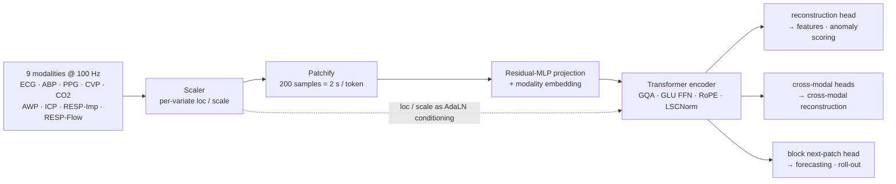

<div align="center">

# CARMEN

### A Cardiorespiratory Foundation Model for Continuous Physiological Waveforms

[](LICENSE)
[](https://www.python.org/)
[](https://pytorch.org/)
[](#-overview)
[](#-overview)

[**Model Weights**](https://github.com/dlcjfgmlnasa/CARMEN/releases) ·
[**Quickstart Notebook**](examples/quickstart.ipynb) ·
[**Examples**](examples) ·
[**Inference API**](#-inference-api)

</div>



## 📖 Overview

**CARMEN** is a foundation model for the continuous waveforms recorded at the bedside
and in the operating room. A **single Transformer encoder (~30M parameters)** is
pretrained across **9 signal modalities** and transfers to three families of task
without architectural surgery: **feature extraction** for downstream heads,
**cross-modal waveform reconstruction**, and **waveform forecasting**.

Two design choices carry most of the weight. Every modality is tokenized the same
way — raw patches, one shared encoder — so a single model covers all nine instead of
one model per signal. And because per-patient normalization would otherwise throw
away the absolute level of a pressure waveform, the `(loc, scale)` stripped out by the
scaler is fed back into **every** layer as AdaLN modulation (`LSCNorm`), keeping
clinically meaningful magnitudes available to the encoder.

The nine modalities split by the mechanism that drives the waveform — the grouping
exposed as `carmen.MECHANISM_GROUP`:

<table>
  <tr>
    <th colspan="4" align="left">🫀&nbsp; Cardiovascular &nbsp;·&nbsp; <sub>locked to the cardiac cycle</sub></th>
  </tr>
  <tr>
    <td></td>
    <td align="center"><code>0</code></td>
    <td><b>ECG</b></td>
    <td>electrocardiogram</td>
  </tr>
  <tr>
    <td></td>
    <td align="center"><code>1</code></td>
    <td><b>ABP</b></td>
    <td>arterial blood pressure, invasive</td>
  </tr>
  <tr>
    <td></td>
    <td align="center"><code>2</code></td>
    <td><b>PPG</b></td>
    <td>photoplethysmography — peripheral pulse</td>
  </tr>
  <tr>
    <td></td>
    <td align="center"><code>3</code></td>
    <td><b>CVP</b></td>
    <td>central venous pressure</td>
  </tr>
  <tr>
    <td></td>
    <td align="center"><code>6</code></td>
    <td><b>ICP</b></td>
    <td>intracranial pressure</td>
  </tr>
  <tr>
    <th colspan="4" align="left">🫁&nbsp; Respiratory &nbsp;·&nbsp; <sub>locked to the ventilation cycle</sub></th>
  </tr>
  <tr>
    <td></td>
    <td align="center"><code>4</code></td>
    <td><b>CO2</b></td>
    <td>capnography — expired CO₂</td>
  </tr>
  <tr>
    <td></td>
    <td align="center"><code>5</code></td>
    <td><b>AWP</b></td>
    <td>airway pressure</td>
  </tr>
  <tr>
    <td></td>
    <td align="center"><code>7</code></td>
    <td><b>RESP_Impedance</b></td>
    <td>chest-impedance respiration</td>
  </tr>
  <tr>
    <td></td>
    <td align="center"><code>8</code></td>
    <td><b>RESP_Flow</b></td>
    <td>ventilator flow</td>
  </tr>
</table>

> [!IMPORTANT]
> CARMEN is pretrained at **100 Hz** with a patch size of **200 samples (2 s/token)**.
> Resample your signals to 100 Hz before use.

> [!NOTE]
> This repository is **inference-only** — the pretraining loop is not included.

## 🚀 Quick Start

### 📦 Installation

```bash
git clone https://github.com/dlcjfgmlnasa/CARMEN.git && cd CARMEN
pip install -e .              # or: pip install -r requirements.txt
```

Requires Python ≥ 3.10, PyTorch ≥ 2.2, einops ≥ 0.7.

### 🧠 Model weights

Weights are distributed as a **GitHub Release asset** and are *not* committed to git.
Download a checkpoint into `checkpoints/` — see [`checkpoints/README.md`](checkpoints/README.md):

```bash
curl -L -o checkpoints/carmen.pt \
  https://github.com/dlcjfgmlnasa/CARMEN/releases/download/v1.0/carmen.pt
```

Each checkpoint embeds its own `ModelConfig`, so the architecture is reconstructed
automatically — you never specify it by hand.

### ✨ Extracting features

```python
import torch
from carmen import DownstreamModelWrapper, make_batch

# 1. Load the pretrained encoder (frozen, eval mode)
wrapper = DownstreamModelWrapper("checkpoints/carmen.pt", device="cpu")

# 2. Pack raw 1-D signals (100 Hz) into a batch — one patient, multiple modalities
t = torch.linspace(0, 30, 3000)
batch = make_batch(
    [("ecg", torch.sin(2*torch.pi*1.2*t)),
     ("ppg", torch.sin(2*torch.pi*1.2*t - 0.6)),
     ("abp", 80 + 30*torch.sin(2*torch.pi*1.2*t - 0.3))],
    patch_size=wrapper.patch_size,
)

# 3. One feature vector per patient
features = wrapper.extract_features(batch)   # (B, d_model)
```

No checkpoint yet? `python examples/00_smoke_test.py` verifies the install against a
randomly initialized model.

## 🧩 Inference API

`CARMEN.from_pretrained(path)` returns the bare encoder; `DownstreamModelWrapper` adds
loading, freezing, pooling and LoRA on top.

| method                                        | purpose                                            |
|-----------------------------------------------|----------------------------------------------------|
| `model.extract_features(batch)`               | encoder embeddings for downstream heads            |
| `model.generate_cross_modal(batch, target)`   | synthesize one modality from the others            |
| `model.forecast(batch)`                       | block next-patch prediction map `(B, N, K, P)`     |
| `model.generate(batch, n_steps)`              | autoregressive waveform roll-out                   |
| `wrapper.extract_features(batch, pool=...)`   | frozen features (+ optional gap-masking / pooling) |
| `wrapper.inject_lora(rank=8)`                 | parameter-efficient fine-tuning of the encoder     |
| `wrapper.get_reconstruction_loss(batch, mask)`| masked reconstruction MSE, for anomaly scoring     |

<details>
<summary><b>Two attention modes — <code>task="masked"</code> vs <code>task="next_pred"</code></b></summary>

<br/>

`forward(batch, task=...)` selects both the attention pattern and the heads that run:

| `task`        | attention     | outputs added                             | used by                                |
|---------------|---------------|-------------------------------------------|----------------------------------------|
| `"masked"`    | bidirectional | `reconstructed`, `cross_pred_per_type`     | `extract_features`, `generate_cross_modal` |
| `"next_pred"` | causal        | `next_pred` `(B, N, K, patch_size)`        | `forecast`, `generate`                 |

Both modes always return the encoder outputs — `encoded`, `patches`, `patch_mask`,
`loc`, `scale`, `patch_sample_id`, `patch_variate_id`, `time_id`.

</details>

<details>
<summary><b>Feeding your own data</b></summary>

<br/>

`make_batch` covers the common case. For full control, build one `BiosignalSample` per
channel and collate them with `PackCollate`:

```python
from carmen import BiosignalSample, PackCollate, CHANNEL_NAME_TO_SIGNAL_TYPE

sample = BiosignalSample(
    values=ecg,                 # 1-D tensor @ 100 Hz
    length=ecg.numel(),
    channel_idx=0, recording_idx=0, n_channels=1, win_start=0,
    sampling_rate=100.0,
    signal_type=CHANNEL_NAME_TO_SIGNAL_TYPE["ECG II"],   # -> 0
    session_id="patient-001",   # samples sharing a session are paired cross-modally
    start_sample=0,
)
batch = PackCollate(max_length=8192, patch_size=200)([sample])
```

`collate_mode="any_variate"` (default) groups a patient's modalities into one row so
the encoder can attend across them; `collate_mode="ci"` treats each signal as an
independent row.

</details>

## 🔬 Examples

| file                                      | what it shows                                     |
|-------------------------------------------|---------------------------------------------------|
| [`quickstart.ipynb`](examples/quickstart.ipynb) | end-to-end notebook (build → features → generate) |
| [`00_smoke_test.py`](examples/00_smoke_test.py) | build from config, run a forward (no weights)     |
| [`01_extract_features.py`](examples/01_extract_features.py) | load a checkpoint, extract features |
| [`02_downstream_probe.py`](examples/02_downstream_probe.py) | linear probe / LoRA on frozen features |
| [`03_cross_modal_generation.py`](examples/03_cross_modal_generation.py) | ECG + PPG → ABP |
| [`04_forecasting.py`](examples/04_forecasting.py) | forecast + autoregressive generation |

```bash
python examples/00_smoke_test.py
python examples/01_extract_features.py checkpoints/carmen.pt
```

## 🗂️ Repository Layout

```
carmen/
├── model.py         CARMEN encoder + inference API
├── config.py        ModelConfig (embedded in every checkpoint)
├── checkpoint.py    checkpoint save / load
├── wrapper.py       DownstreamModelWrapper (load / freeze / LoRA), LinearProbe
├── batch.py         make_batch / to_device — raw signals -> PackedBatch
├── loss.py          MaskedPatchLoss (reconstruction scoring)
├── data/            PackCollate (bin-packing), BiosignalSample, signal-type maps
└── modules/         attention (GQA), GLU FFN, RMSNorm / LSCNorm, patch embedding,
                     packed scalers, RoPE / attention bias
examples/            runnable examples + quickstart notebook
checkpoints/         put downloaded weights here (gitignored)
```

## ⚠️ Caveats

- **Cross-modal reliability.** Not every source → target pair is physiologically
  supported. The pairs the model was trained to transfer across are listed in
  `carmen.CROSS_PRED_ALLOWED_PAIRS` (ECG↔ABP, ECG↔PPG, ABP↔PPG, AWP↔RESP_Flow).
- **Denormalized output is approximate.** `generate_cross_modal(..., denormalize=True)`
  rescales with the *source* signal's `loc`/`scale`, because the target's own level is
  unknown. Treat the absolute magnitude accordingly.
- **`any_variate` batching is non-deterministic.** `PackCollate` trims a patient's
  variates to one common length so they pair up; with unequal-length inputs that length
  is drawn at random. Seed `random.seed()` if you need reproducible batches, or use
  `collate_mode="ci"`.

## 🙏 Acknowledgements

The model building blocks — grouped-query attention, GLU feed-forward, packed scalers,
rotary/binary attention bias — are adapted from
[uni2ts](https://github.com/SalesforceAIResearch/uni2ts) (Salesforce, Apache 2.0).
See [`NOTICE`](NOTICE) for the derived-file list.

## 📜 Citation

A paper describing CARMEN is in preparation. Until it is out, please cite this
repository:

```bibtex
@software{carmen2026,
  title  = {CARMEN: A Cardiorespiratory Foundation Model for Continuous Physiological Waveforms},
  author = {The CARMEN Authors},
  year   = {2026},
  url    = {https://github.com/dlcjfgmlnasa/CARMEN}
}
```

## ⚖️ License

Released under the [Apache License 2.0](LICENSE).
